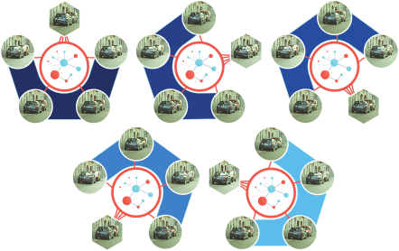
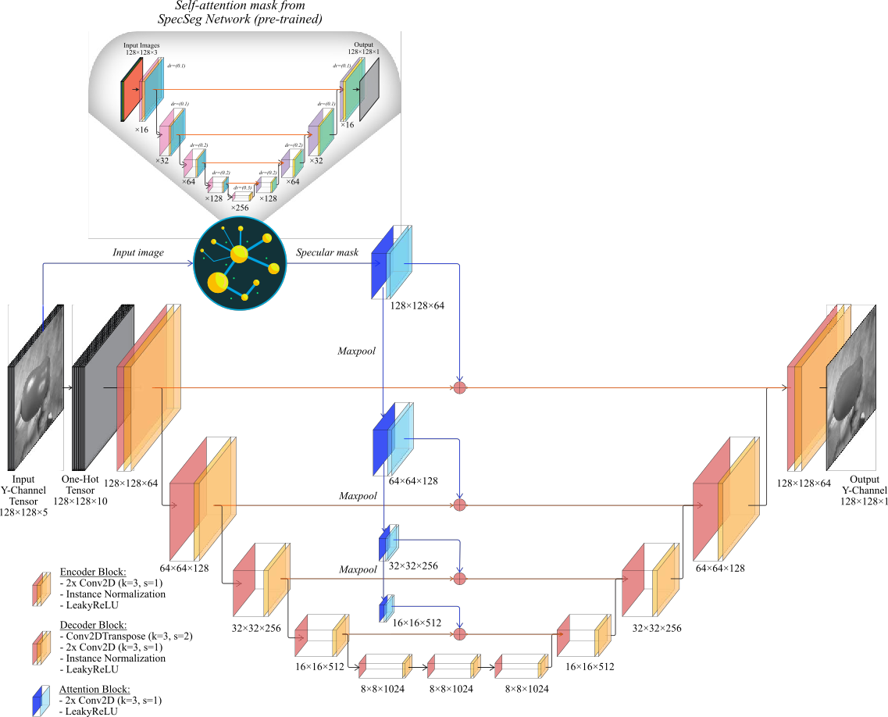
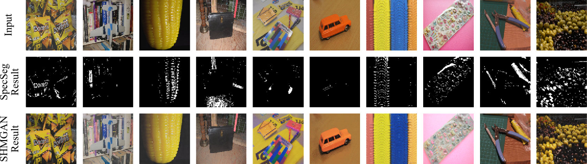

<a name="readme"></a>

<!-- [![Contributors][contributors-shield]][contributors-url] -->
![Python][python-shield]
![Tensorflow][tf-shield]
[![Issues][issues-shield]][issues-url]
[![MIT License][license-shield]][license-url]
[![LinkedIn][linkedin-shield]][linkedin-url]
<!-- [![Stargazers][stars-shield]][stars-url] -->

<!-- PROJECT LOGO -->
<br />
<div align="center">
    
  </a>
  <h3 align="center">Joint network for specular highlight detection and adversarial generation of specular-free images trained with polarimetric data</h3>

  <p align="center">
    Official repository for the article @ <a href="https://authors.elsevier.com/a/1hqRr3INukOUwT"><strong>Neurocomputing Journal</strong></a> (Elsevier, ScienceDirect)
    <br />
  </p>
</div>


<!-- ABOUT THE PROJECT -->
## Citation

```
@article{Anwer2023,
  doi = {10.1016/j.neucom.2023.126769},
  url = {https://doi.org/10.1016/j.neucom.2023.126769},
  year = {2023},
  month = nov,
  publisher = {Elsevier {BV}},
  volume = {559},
  pages = {126769},
  author = {Atif Anwer and Samia Ainouz and Naufal M. Saad and Syed Saad Azhar Ali and Fabrice Meriaudeau},
  title = {Joint network for specular highlight detection and adversarial generation of specular-free images trained with polarimetric data},
  journal = {Neurocomputing}
}
```
The <a href="#readme-top">article </a> can be viewed and downloaded from Neurocomputing (Elsevier ScienceDirect).
<p align="right">(<a href="#readme-top">back to top</a>)</p>


<!-- GETTING STARTED -->
## Introduction

This repository is the code of our paper 'Joint network for specular highlight detection and adversarial generation of specular-free images trained with polarimetric data'.

SHMGAN consists of a single generator–discriminator pair trained simultaneously using polarimetric images. The proposed GAN uses a dynamically generated attention mask based on a specularity segmentation network <a href="https://github.com/Atif-Anwer/SpecSeg"><strong>(SpecSeg)</strong></a> without requiring additional manual input. The network is able to learn the illumination variation between the four polarimetric images and a pseudo-diffuse image. Once trained, SHMGAN is able to generate specular-free image from a single RGB image as input; without requiring any additional external labels.

The developed network can be used for network training and testing. Please cite the paper if you use them and find them useful.

<div align="center">
        <br>
        </br>
        </a>SHMGAN Generator with SpecSeg</a>
        <br />
</div>
<div align="center">
    
        </a>
        <p align="center">
        Full article @ <a href="https://authors.elsevier.com/a/1hqRr3INukOUwT"><strong>Neurocomputing Journal</strong></a>
        <br />
        </p>
</div>

## Requirements
- Tested with Python 3.8, Tensorflow 2.8 on local system (Nvidia RTX 3070, 8GB VRAM, 32GB Ram and CUDA 11.8)
- Tested with Python 3.7, Tensorflow 2.8+ on Google Colab
- Uses Tensorflow Function API for a custom training loop for a multi-input GAN (see the paper for details)
- Uses the <a href="https://github.com/qubvel/segmentation_models">Segmentation Models </a> library
- Training also uses <a href="https://www.comet.com/site/">Comet.ml</a> for logging the GAN training/generation progress and generating the confusion matrices (Optional, and commented out by default).

## Datasets
The datasets used in the paper can be found at the following Github Repos (property of the respective authors):
1. <a href="https://github.com/jianweiguo/SpecularityNet-PSD">PSD Dataset</a>, Wu et al.
2. <a href="https://github.com/fu123456/SHIQ">SIHQ Dataset</a>, Fu et al.

<!-- USAGE EXAMPLES -->
## Usage
For training on your dataset, please run `main.py` with the required paths to the datsaet.

<p align="right">(<a href="#readme-top">back to top</a>)</p>


<!-- LICENSE -->
## License
Distributed under the GNU General Public License v3.0 License, for research training and/or testing purposes. Pleas cite our paper if you use this code or network.
For more details, please see [Choose a license](https://choosealicense.com/licenses/gpl-3.0/).
<p align="right">(<a href="#readme-top">back to top</a>)</p>


<!-- MARKDOWN LINKS & IMAGES -->
[python-shield]: https://img.shields.io/badge/Python-3.8-blue?style=for-the-badge&logo=appveyor
[tf-shield]: https://img.shields.io/badge/Tensorflow-2.8-orange?style=for-the-badge&logo=appveyor

[issues-shield]: https://img.shields.io/github/issues/Atif-Anwer/SpecSeg?style=for-the-badge
[issues-url]: https://github.com/Atif-Anwer/SpecSeg/issues
[license-shield]: https://img.shields.io/badge/License-CC-brightgreen?style=for-the-badge
[license-url]: https://github.com/othneildrew/Best-README-Template/blob/master/LICENSE.txt
[linkedin-shield]: https://img.shields.io/badge/-LinkedIn-black.svg?style=for-the-badge&logo=linkedin&colorB=555
[linkedin-url]: https://www.linkedin.com/in/atifanwer/

<!-- Soruce: https://github.com/othneildrew/Best-README-Template/pull/73 -->